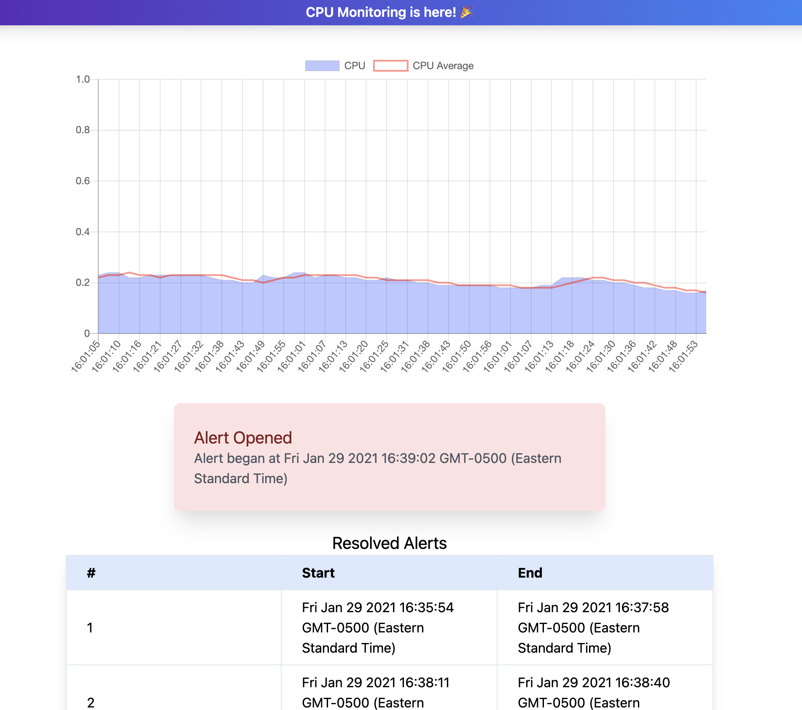

## CPU Monitor Mini-App

This project was bootstrapped with [Create React App](https://github.com/facebook/create-react-app).



### Future Improvements

- Improve alerting logic (above cpu threshold *for a specific amount of time* to trigger, vice versa to resolve)
- Create a better testing story, specifically, unit testing the `services/index.tsx` methods and `hooks/useTick.tsx`, as well as at least one integration test against `pages/App.tsx` (beyond the boilerplate test currently there.

### Start app

#### `cp .env.sample .env`

Configuration is derived from environment variables, so a sample set of environment variables have been provided.

#### `npm install`

Installs dependencies.
Might take a bit first time CRACO/PostCSS/Tailwind

#### `npm start`

Runs the app in the development mode.
Open [http://localhost:3000](http://localhost:3000) to view it in the browser.

### Server Instructions

The app expects an endpoint at localhost:3001/cpu. This address is configurable in `config.tsx` as well as via environment variable `CPU_URL`. 
This enable the app to poll for the lastest cpu usage. The server expects a json response `{ cpu: <value: number> }`.

#### Example NodeJS (Express) Server
```
const express = require('express');
const os = require('os');
const cors = require('cors');
const app = express();
const port = 3001;
app.use(cors());
app.options('*', cors());

app.get('/', (_req, res) => { res.send(); });

app.get('/cpu', (_req, res) => {
	const loadAvg = os.loadavg()[0]/os.cpus().length;
	console.debug("load avg: " + Math.floor(loadAvg*100)/100);
	res.json({ cpu: loadAvg });
});

app.listen(port, () => {
	console.log(`Example app listening at http://localhost:${port}`);
});
```

### Install & Run Sample Server

#### `npm install express cors --save`
#### `node index.js`
